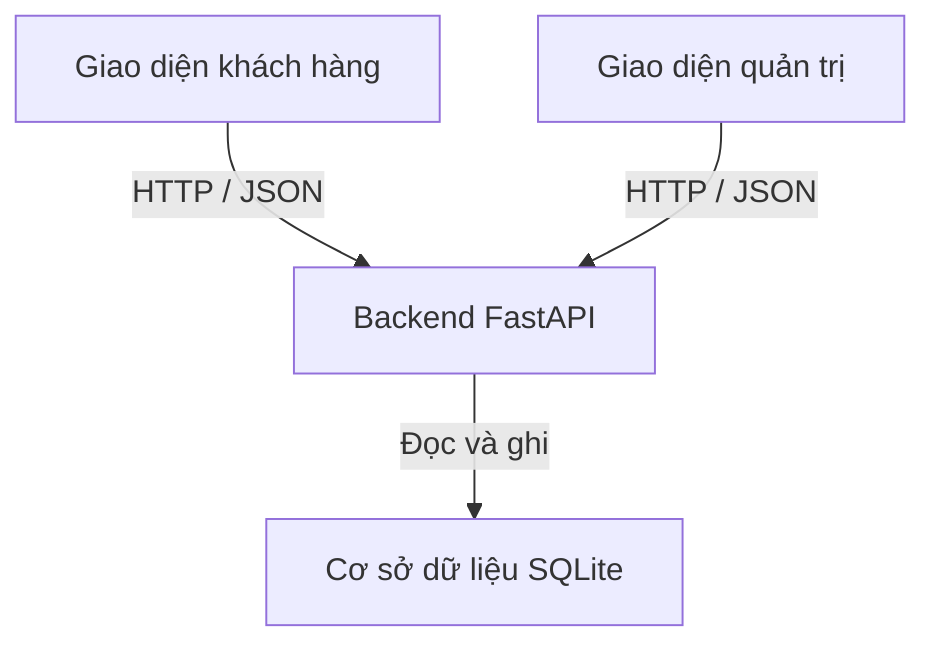

# Thiết kế hệ thống sơ bộ

## 1. Phạm vi
Website đặt đồ ăn cho sinh viên VJU, bản đầu phục vụ một quán.
Chưa tích hợp AI và thanh toán trực tuyến tự động.

## 2. Kiến trúc 3 tầng

### Tầng giao diện
- Sử dụng HTML, CSS và JavaScript.
- Hiển thị thực đơn, giỏ hàng, biểu mẫu đặt hàng và trạng thái đơn.
- Cung cấp màn hình đăng nhập, quản lý món và xử lý đơn.
- Gọi API để lấy hoặc cập nhật dữ liệu.
- Có giao diện phù hợp với điện thoại và máy tính.

### Tầng backend
- Sử dụng Python và FastAPI.
- Kiểm tra dữ liệu đầu vào và quyền truy cập.
- Kiểm tra tình trạng món, tính tiền và tạo đơn.
- Kiểm soát chuyển trạng thái đơn, ghi nhận thanh toán.
- Trả kết quả hoặc thông báo lỗi dạng JSON.

### Tầng dữ liệu
- Sử dụng SQLite cho bản đầu quy mô nhỏ.
- Lưu món, đơn hàng, chi tiết đơn và tài khoản quản trị.
- Có thể xem xét PostgreSQL khi nhu cầu truy cập đồng thời tăng.
- Cơ sở dữ liệu không được phục vụ như một file tải công khai.

### Triển khai dự kiến
- Triển khai trên VPS của học phần.
- Frontend và API sử dụng cùng tên miền.
- Truy cập thực tế qua HTTPS.
- Xác nhận cấu hình VPS trước khi chọn cách triển khai cụ thể.

## 3. Các màn hình chính

| Màn hình | Nội dung |
|---|---|
| Thực đơn | Danh sách món, giá, tình trạng còn/hết |
| Giỏ hàng và đặt món | Số lượng, thông tin khách, khung giờ, điểm nhận |
| Đặt thành công | Mã đơn, mã tra cứu và hướng dẫn nhận món |
| Theo dõi đơn | Chi tiết đơn, trạng thái xử lý và thanh toán |
| Đăng nhập quản trị | Đăng nhập bằng tài khoản quản trị |
| Quản lý món | Thêm, sửa, ẩn và cập nhật tình trạng món |
| Quản lý đơn | Xem đơn, xác nhận, cập nhật trạng thái và thu tiền |

## 4. Thiết kế API REST

Tất cả đường dẫn bắt đầu bằng /api.
Dữ liệu trao đổi sử dụng JSON.

### API khách hàng

| Method | Đường dẫn | Đầu vào | Đầu ra khi thành công |
|---|---|---|---|
| GET | /api/dishes | Từ khóa, loại món nếu có | 200: danh sách món đang hiển thị |
| GET | /api/dishes/{id} | ID món | 200: chi tiết món |
| GET | /api/pickup-options | Không | 200: điểm nhận và khung giờ có thể chọn |
| POST | /api/orders | Thông tin khách, điểm/giờ nhận, danh sách món, khóa chống trùng | 201: mã đơn, mã tra cứu, tổng tiền |
| GET | /api/orders/{code} | Mã đơn; mã tra cứu trong header Authorization | 200: thông tin đơn được phép xem |

### API quản trị

| Method | Đường dẫn | Đầu vào | Đầu ra khi thành công |
|---|---|---|---|
| POST | /api/admin/login | Tên đăng nhập, mật khẩu | 200: tạo phiên đăng nhập |
| POST | /api/admin/logout | Phiên đăng nhập hiện tại | 204: kết thúc phiên |
| POST | /api/admin/dishes | Thông tin món | 201: món vừa tạo |
| PATCH | /api/admin/dishes/{id} | Các trường cần sửa | 200: món đã cập nhật |
| GET | /api/admin/orders | Bộ lọc trạng thái, phân trang | 200: danh sách đơn |
| GET | /api/admin/orders/{code} | Mã đơn | 200: chi tiết đơn |
| PATCH | /api/admin/orders/{code}/status | Trạng thái mới, lý do nếu hủy | 200: đơn đã cập nhật |
| PATCH | /api/admin/orders/{code}/payment | Trạng thái đã thanh toán | 200: thông tin thanh toán |

Ngoại trừ đăng nhập, mọi API quản trị đều yêu cầu phiên hợp lệ.
Ẩn món bằng PATCH với is_active=false, không xóa món đã có trong đơn.

### Mã lỗi dự kiến
- 401: chưa đăng nhập hoặc thông tin xác thực không hợp lệ.
- 403: không có quyền thực hiện.
- 404: không tìm thấy tài nguyên.
- 409: giá thay đổi, món hết hàng, trạng thái xung đột hoặc khóa chống trùng bị dùng sai.
- 422: dữ liệu đầu vào không hợp lệ.
- 429: gửi yêu cầu quá nhiều.
- 500: lỗi hệ thống, không trả chi tiết kỹ thuật nhạy cảm cho khách.

## 5. Cơ sở dữ liệu sơ bộ

Tiền lưu bằng số nguyên, đơn vị VND.
Thời gian lưu thống nhất và hiển thị theo múi giờ Việt Nam.

### dishes — Món ăn
- id: khóa chính.
- name: tên món.
- category: loại món.
- description: mô tả.
- image_url: đường dẫn ảnh.
- price: giá hiện tại, không âm.
- is_available: còn hàng hay hết hàng.
- is_active: hiển thị hay đã ẩn.

### pickup_points — Điểm nhận
- id: khóa chính.
- name: tên điểm nhận.
- address: địa chỉ hoặc hướng dẫn.
- is_active: có cho phép chọn không.

### pickup_slots — Khung giờ nhận
- id: khóa chính.
- starts_at: thời điểm bắt đầu.
- ends_at: thời điểm kết thúc.
- cutoff_at: hạn chốt đơn.
- is_active: có cho phép chọn không.

### orders — Đơn hàng
- id: khóa chính nội bộ.
- code: mã đơn duy nhất.
- lookup_token_hash: bản băm mã tra cứu bí mật.
- customer_name: tên khách.
- customer_phone: số điện thoại.
- pickup_point_id: tham chiếu pickup_points.
- pickup_slot_id: tham chiếu pickup_slots.
- pickup_point_snapshot: thông tin điểm nhận tại lúc đặt.
- pickup_time_snapshot: khung giờ nhận tại lúc đặt.
- note: ghi chú.
- status: trạng thái xử lý.
- payment_status: unpaid hoặc paid.
- total_amount: tổng tiền.
- idempotency_key: khóa chống tạo đơn trùng, duy nhất.
- request_fingerprint: dấu vết nội dung yêu cầu để kiểm tra lần gửi lại.
- cancel_reason: lý do hủy nếu có.
- created_at: thời điểm tạo.
- updated_at: thời điểm cập nhật.

### order_items — Chi tiết đơn
- id: khóa chính.
- order_id: tham chiếu orders.
- dish_id: tham chiếu dishes.
- dish_name_snapshot: tên món tại lúc đặt.
- unit_price: giá một món tại lúc đặt.
- quantity: số lượng nguyên dương.

Thành tiền mỗi dòng = unit_price × quantity.
Tổng tiền đơn = tổng thành tiền các dòng.

### admins — Tài khoản quản trị
- id: khóa chính.
- username: tên đăng nhập duy nhất.
- password_hash: mật khẩu đã băm.
- is_active: tài khoản có hoạt động không.

### admin_sessions — Phiên quản trị
- id: khóa chính.
- admin_id: tham chiếu admins.
- token_hash: bản băm token phiên.
- expires_at: thời điểm hết hạn.
- revoked_at: thời điểm thu hồi nếu có.

### Quan hệ chính
- Một đơn có nhiều dòng chi tiết đơn.
- Một món có thể xuất hiện trong nhiều dòng chi tiết đơn.
- Một điểm nhận có nhiều đơn.
- Một khung giờ nhận có nhiều đơn.
- Một quản trị viên có thể có nhiều phiên đăng nhập.

## 6. Luồng tạo đơn
1. Khách chọn món và số lượng.
2. Frontend gửi thông tin nhận món cùng khóa chống trùng.
3. Backend kiểm tra dữ liệu, điểm/giờ nhận và tình trạng món.
4. Backend đối chiếu giá khách đã xem với giá hiện tại.
5. Nếu giá thay đổi, yêu cầu khách xác nhận lại.
6. Backend tính tổng tiền, tạo mã đơn và mã tra cứu bí mật.
7. Lưu đơn và các dòng chi tiết trong cùng một giao dịch dữ liệu.
8. Chỉ trả thông báo thành công sau khi lưu thành công.

Nếu gửi lại cùng khóa và cùng nội dung, hệ thống trả lại đơn
đã tạo, không tạo đơn mới. Cơ chế triển khai phải bảo đảm
khách có thể tiếp tục tra cứu đơn khi phản hồi đầu bị mất.

## 7. Luồng xử lý và thanh toán
- pending → confirmed → preparing → ready → completed.
- Đơn chưa hoàn thành có thể chuyển sang cancelled theo quy định.
- Hủy đơn bắt buộc có lý do.
- Đơn completed hoặc cancelled không chuyển tiếp trong bản đầu.
- Thanh toán lưu riêng: unpaid hoặc paid.
- Hoàn thành đơn khi đã giao món và đã ghi nhận thu tiền.
- Việc hủy đơn đã thu tiền cần xử lý hoàn tiền riêng; chưa tự động hóa trong MVP.

## 8. Bảo vệ truy cập và dữ liệu
- Backend kiểm tra quyền trên mọi API quản trị.
- Phiên quản trị dùng cookie HttpOnly, Secure và SameSite phù hợp.
- Các thao tác thay đổi dữ liệu bằng cookie có biện pháp chống CSRF.
- Giới hạn số lần đăng nhập và tra cứu thất bại.
- Không đưa mã tra cứu bí mật vào URL hoặc nhật ký truy cập.
- Không công khai số điện thoại và danh sách đơn.
- Có sao lưu cơ sở dữ liệu và kiểm tra khôi phục.
- Điểm nhận và khung giờ ban đầu được cấu hình sẵn;
  giao diện quản lý các mục này chưa thuộc MVP.
