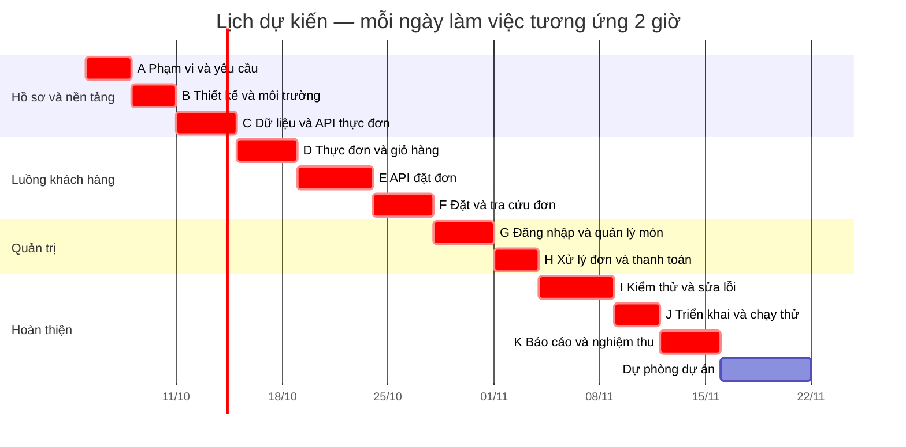

# Kế hoạch thời gian — Gantt và đường găng

## 1. Giả định lập kế hoạch
- Người thực hiện: Lâm Hải Sơn.
- Nhân lực: một người.
- Ngày bắt đầu dự kiến: 05/10/2026.
- Mỗi buổi làm việc: 2 giờ tập trung.
- Mỗi tuần: 6 buổi, từ thứ Hai đến thứ Bảy.
- Chủ nhật nghỉ hoặc xử lý việc cá nhân.
- Một “ngày” trên Gantt tương ứng một buổi 2 giờ.
- Kế hoạch gồm 42 buổi công việc và 6 buổi dự phòng.
- Tổng quỹ thời gian: 48 buổi, tương đương 96 giờ.

Lịch cần cập nhật theo hạn nộp chính thức, tiến độ thực tế
và phản hồi của giảng viên/quán hợp tác.

## 2. Cách ước lượng
- Ước lượng theo từng nhóm sản phẩm bàn giao trong WBS.
- Bao gồm thời gian đọc hiểu code, chạy thử và sửa lỗi thông thường.
- Dùng AI hỗ trợ nhưng vẫn cần kiểm tra kết quả.
- Đây là ước lượng sơ bộ, chưa phải cam kết hoàn thành.
- Sau mỗi tuần, cập nhật phần việc còn lại dựa trên kết quả thực tế.

Các hàng dưới đây là nhóm hoạt động để lập lịch tổng thể.
Khi đưa vào backlog, tách thành việc nhỏ khoảng 1–2 buổi;
không giao nguyên một nhóm nhiều buổi làm một việc duy nhất.

## 3. Danh sách hoạt động

| Mã | Sản phẩm/hoạt động | WBS liên quan | Phụ thuộc kỹ thuật trước | Buổi | Giờ |
|---|---|---|---|---:|---:|
| A | Hồ sơ phạm vi, yêu cầu và quy trình phối hợp quán | 1.1 | Không | 3 | 6 |
| B | Thiết kế, kế hoạch và môi trường phát triển | 1.1, 1.2.1 | A | 3 | 6 |
| C | CSDL, dữ liệu mẫu và API thực đơn | 1.2.2–1.2.4, 1.3.1 | B | 4 | 8 |
| D | Trang thực đơn, tìm kiếm và giỏ hàng | 1.4.1–1.4.3 | C | 4 | 8 |
| E | API đặt đơn, tính tiền và chống trùng | 1.3.4–1.3.5 | C | 5 | 10 |
| F | Biểu mẫu đặt, trang thành công và tra cứu đơn | 1.3.6, 1.4.4–1.4.7 | D, E | 4 | 8 |
| G | Đăng nhập và quản lý món | 1.3.2–1.3.3, 1.5.1–1.5.2 | C | 4 | 8 |
| H | Quản lý đơn, trạng thái và thanh toán | 1.3.7–1.3.8, 1.5.3–1.5.5 | E, G | 3 | 6 |
| I | Hoàn thiện điện thoại, kiểm thử và xử lý lỗi | 1.4.8, 1.6 | F, H | 5 | 10 |
| J | VPS, HTTPS, sao lưu và vận hành thử | 1.7 | I | 3 | 6 |
| K | Báo cáo, slide và nghiệm thu | 1.8 | J | 4 | 8 |
| | **Tổng công việc** | | | **42** | **84** |

Ghi chú:
- WBS 1.1.5 được cập nhật xuyên suốt; thời gian cập nhật ngắn
  được tính trong từng nhóm hoạt động.
- Có thể viết dần báo cáo trước K; K là thời gian tổng hợp và hoàn thiện.
- Kết nối và xác nhận với quán bắt đầu ở A, không đợi đến J.
- Thời gian chờ quán hoặc chờ cấp VPS là rủi ro bên ngoài,
  cần theo dõi riêng.

## 4. Điều chỉnh theo nguồn lực một người
Theo kỹ thuật, một số hoạt động có thể làm song song.
Ví dụ D và E đều có thể bắt đầu khi C hoàn thành.

Tuy nhiên, dự án chỉ có một người thực hiện nên lịch chọn
thứ tự lần lượt:

A → B → C → D → E → F → G → H → I → J → K.

Các quan hệ thêm để tránh trùng lịch nguồn lực:
- D → E.
- F → G.

Đây là quan hệ do cách phân bổ nhân lực, không phải tất cả
đều là phụ thuộc kỹ thuật bắt buộc.

## 5. Tính CPM trên lịch đã bổ sung ràng buộc nguồn lực
Quy ước:
- Mốc 0 là trước buổi làm việc đầu tiên.
- ES: bắt đầu sớm nhất.
- EF: kết thúc sớm nhất.
- LS: bắt đầu muộn nhất mà không làm trễ mốc hoàn thành 42 buổi.
- LF: kết thúc muộn nhất.
- Float = LS − ES.
- EF = ES + thời lượng.

| Mã | Thời lượng | ES | EF | LS | LF | Float |
|---|---:|---:|---:|---:|---:|---:|
| A | 3 | 0 | 3 | 0 | 3 | 0 |
| B | 3 | 3 | 6 | 3 | 6 | 0 |
| C | 4 | 6 | 10 | 6 | 10 | 0 |
| D | 4 | 10 | 14 | 10 | 14 | 0 |
| E | 5 | 14 | 19 | 14 | 19 | 0 |
| F | 4 | 19 | 23 | 19 | 23 | 0 |
| G | 4 | 23 | 27 | 23 | 27 | 0 |
| H | 3 | 27 | 30 | 27 | 30 | 0 |
| I | 5 | 30 | 35 | 30 | 35 | 0 |
| J | 3 | 35 | 38 | 35 | 38 | 0 |
| K | 4 | 38 | 42 | 38 | 42 | 0 |

Đường găng trên mạng công việc đã bổ sung ràng buộc nguồn lực:
A → B → C → D → E → F → G → H → I → J → K.

Tổng thời lượng: 42 buổi = 84 giờ = 7 tuần theo lịch giả định.

Tất cả hoạt động có Float bằng 0 vì lịch thực hiện tuần tự,
không có khoảng trống giữa các hoạt động.

Kết quả này phụ thuộc vào thứ tự đã chọn và các ước lượng;
không phải khẳng định đây là thời gian tối thiểu tuyệt đối
cho mọi cách tổ chức dự án.

## 6. Biểu đồ Gantt

## 7. Mốc kiểm tra

| Mốc | Kết quả cần đạt |
|---|---|
| Sau B | Hồ sơ và thiết kế sẵn sàng, chạy được môi trường phát triển |
| Sau C | Đọc được thực đơn từ API và cơ sở dữ liệu |
| Sau F | Khách đặt được đơn, đơn được lưu và tra cứu được |
| Sau H | Quản trị viên quản lý món, xử lý đơn và ghi nhận thu tiền được |
| Sau I | Luồng chính và quyền truy cập đã được kiểm thử |
| Sau J | Web chạy trên VPS, thử sao lưu/khôi phục và vận hành thực tế |
| Sau K | Có báo cáo, slide và minh chứng nghiệm thu |

## 8. Dự phòng và xử lý chậm tiến độ
- Dự phòng 6 buổi, tương đương 12 giờ.
- Đây là quỹ dự phòng của dự án, không phải Float trong bảng CPM.
- Dùng cho lỗi khó, chậm cấu hình VPS hoặc phản hồi khi chạy thử.
- Nếu cần thêm thời gian, ưu tiên hoãn chức năng Should
  như tìm kiếm, lọc và ghi chú trước khi giảm chất lượng luồng Must.
- Không bỏ kiểm tra quyền, tính tiền phía backend hoặc lưu dữ liệu.
- Không thêm AI, thanh toán tự động hay theo dõi shipper vào lịch này.
- Nếu vượt quỹ dự phòng, cập nhật lịch và trao đổi lại phạm vi.

## 9. Theo dõi tiến độ
Cuối mỗi tuần ghi:
- Việc đã hoàn thành và bằng chứng: commit, ảnh hoặc kết quả kiểm thử.
- Số giờ thực tế.
- Việc còn lại và ước lượng mới.
- Vấn đề đang chặn tiến độ.
- Các điều chỉnh cho tuần tiếp theo.
